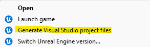
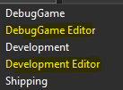

# Unreal Advanced Physics Project

## How to build

- Install Unreal Engine 5.4 on Epic Games Launcher and the latest version of Visual Studio 2022.
- Once cloned, right click on .uproject file and hit "Generate Visual Studio project files". \

- Launch the now generated .sln file.
- You will have 5 different configurations. Use "DebugGame Editor" for Debug and "Development Editor" for Release. \

- Right click on the project and hit "Build" (optional).
- Launch with "Local Windows Debugger" and Unreal Engine should start.
